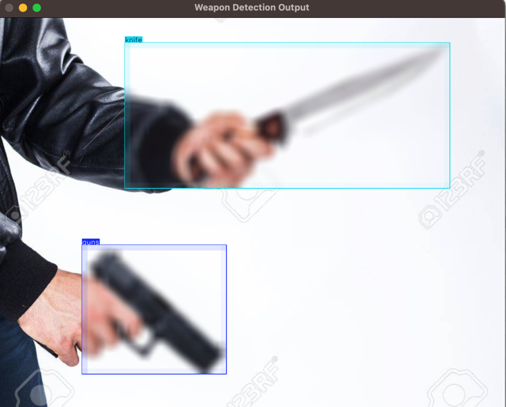

# Weapon Detection and Blurring using Ultralytics

This project demonstrates a method for detecting weapons in images using a YOLOv8 model and automatically blurring the detected weapon regions. This can be useful in security applications to identify and obscure weapons in images for privacy and safety purposes.



## Table of Contents

1. [Introduction](#introduction)
2. [Features](#features)
3. [Installation](#installation)
4. [Usage](#usage)
5. [Configuration](#configuration)
6. [Dependencies](#dependencies)
7. [License](#license)

## Introduction

The `WeaponImageProcessor` class uses a YOLOv8 model to detect weapons in images. Once a weapon is detected, it applies a blurring effect to the detected region. This can help in scenarios where displaying weapon images is not appropriate or allowed, providing a way to censor such content automatically.

## Features

- **Weapon Detection**: Detects weapons in images using a YOLOv8 model.
- **Automatic Blurring**: Blurs the detected weapon regions to obscure them.
- **Real-time Image Processing**: Processes images and displays the result in real-time.

## Installation

To set up this project locally, follow these steps:

1. **Clone the repository**:

   ```bash
   git clone https://github.com/danieletukudo/Weapon-Detection-and-Blurring.git
   cd Weapon-Detection-and-Blurring
   ```

2. **Install required packages**:

   Make sure you have Python installed. Then, install the necessary Python packages using:

   ```bash
   pip install -r requirements.txt
   ```

   The `requirements.txt` file should contain:
   ```text
   opencv-python
   ultralytics
   numpy
   ```

3. **Download the YOLOv8 weights file**:

   Download the trained YOLOv8 weights file and place it in the project directory. Update the file path in the script if it's different from `best.pt`.

## Usage

To use the weapon detection and blurring functionality, follow these steps:

1. **Prepare an image**: Ensure you have an image file (e.g., `img.png`) that you want to process. Place this image in the project directory or provide the path to it.

2. **Run the script**:

   Execute the script using Python:

   ```bash
   python main.py
   ```

   
3. **View the output**:

   The script will load the specified image, detect weapons using the YOLOv8 model, apply a blur to the detected weapon regions, and display the processed image in a window titled "Weapon Detection Output".

## Configuration

- **Image Path**: Update the `image_file` variable in the `if __name__ == "__main__":` block to specify the path to the image you want to process.
- **YOLOv8 Model Path**: The default model path is set to `best.pt`. Update this if your model file is named differently or located in another directory.
- **Blur Ratio**: The `blur_ratio` parameter can be adjusted in the `process_image` method to change the intensity of the blur effect. Higher values will produce a stronger blur.

## Dependencies

This project depends on the following Python libraries:

- `opencv-python`: For image processing and display.
- `ultralytics`: For YOLOv8 model loading and inference.
- `numpy`: For numerical operations on image data.

Install these dependencies via `pip install -r requirements.txt`.

## License

This project is licensed under the MIT License - see the [LICENSE](LICENSE) file for details.
